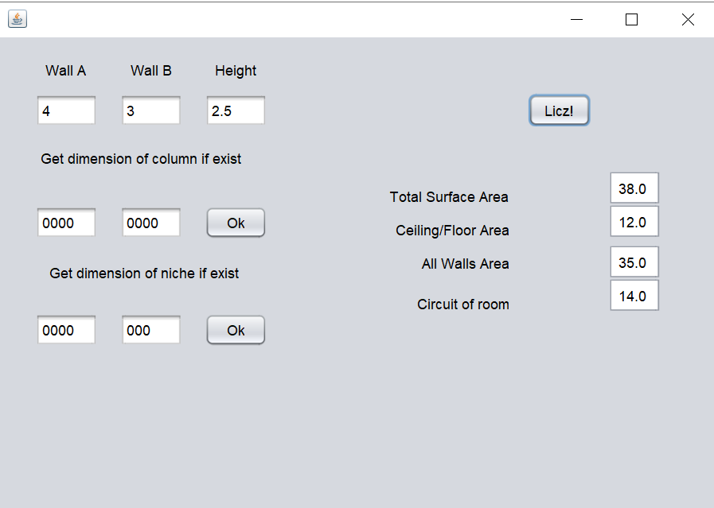

<html>
# ConstructionCalculator
It's simple swing application to calculate surface area of room
In view are able options to add column and niche, but they are not working beacouse I dropped swing project, and working on WEB in new repository: "RenovationCalculator" 
  
</html>
